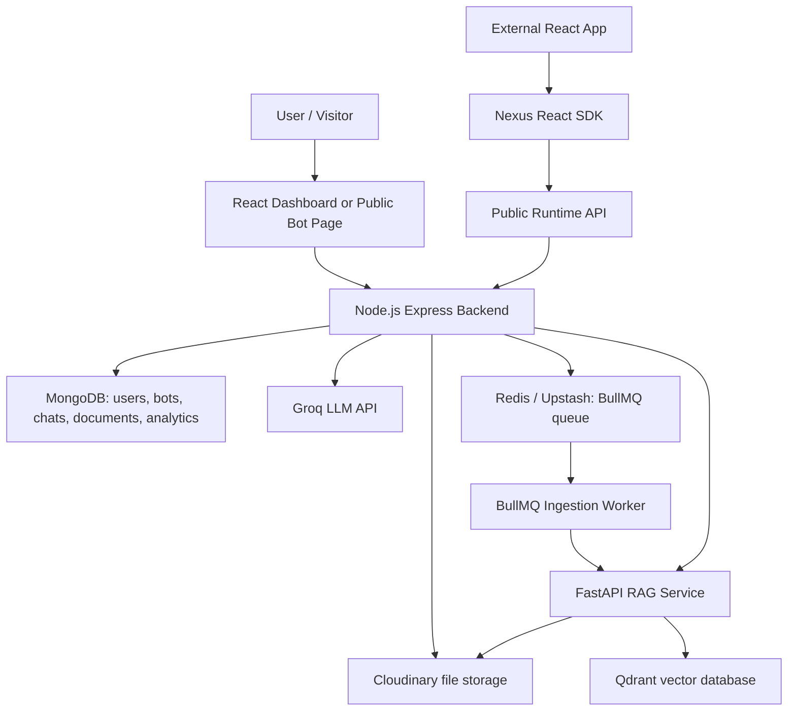
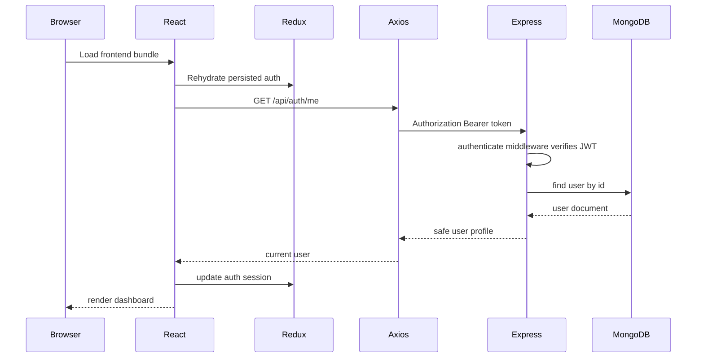
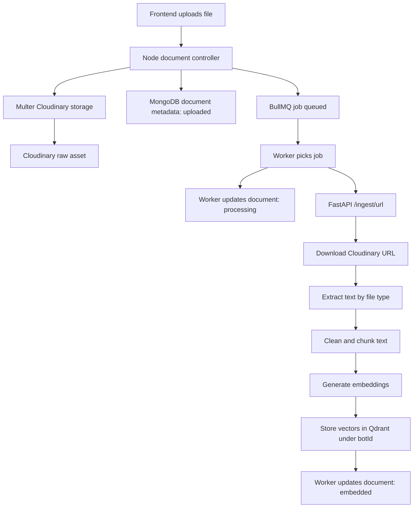
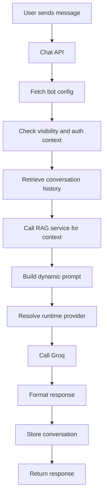

# Nexus AI Technical Documentation

> Project: No-Code AI Chatbot Builder with Developer SDK  
> Documentation purpose: placement preparation, technical interview study, and AI tutor handoff  
> Scope: frontend, backend, Python RAG service, React SDK package, infrastructure, security, APIs, data flow, and debugging

## 1. High-Level Overview

### 1.1 What This Project Does

Nexus AI is a production-style AI SaaS platform that lets users create, configure, deploy, and embed AI chatbots without building AI infrastructure themselves.

The platform treats each chatbot as a runtime configuration rather than as a separately deployed application. A bot is stored as data: behavior settings, appearance settings, runtime provider settings, deployment settings, knowledge documents, and public API credentials. At request time, the backend dynamically loads that data, retrieves knowledge context, builds a prompt, calls the LLM provider, stores conversation data, and returns a response.

This is closer to an AI infrastructure platform than a simple chatbot demo.

### 1.2 Problem It Solves

Building a useful AI chatbot normally requires many separate systems:

| Problem | Nexus AI Solution |
| --- | --- |
| Users need an AI chatbot but do not want to code | Bot Builder and Appearance Builder |
| Bots need custom behavior | Dynamic prompt builder uses role, tone, instructions, format, history, and context |
| Bots need private knowledge | RAG pipeline parses documents, chunks text, embeds chunks, and stores vectors in Qdrant |
| Documents should not block API requests | BullMQ worker processes ingestion asynchronously |
| Developers need website embedding | React SDK package and public runtime APIs |
| SaaS needs tenant isolation | All protected bot/document operations validate owner identity |
| Production needs scalable storage | Cloudinary for files, MongoDB for metadata, Qdrant for vectors, Upstash/local Redis for jobs |

### 1.3 Target Users

1. SaaS customers who want support or knowledge bots.
2. College placement teams that want policy assistants.
3. Developers who want to embed chatbots using SDKs.
4. Product teams that want runtime-configurable AI assistants.
5. Interviewers evaluating backend, AI infrastructure, and system design skills.

### 1.4 Real-World Use Case

Example: a college creates a "Placement Policy Assistant".

1. A user signs up.
2. The user creates a bot named "Placement Policy Assistant".
3. The user uploads placement PDFs, CSVs, DOCX files, or HTML documents.
4. The backend stores the file in Cloudinary and creates a document record.
5. A BullMQ worker sends the Cloudinary URL to the FastAPI RAG service.
6. The RAG service downloads the file, extracts text, chunks it, creates embeddings, and stores vectors in Qdrant under that bot ID.
7. The user deploys the bot.
8. Visitors open `/bot/:botId` or embed `<ChatBot botId="..." publicKey="..." />`.
9. Runtime chat requests retrieve Qdrant context and call Groq.
10. The visitor receives a knowledge-grounded answer.

### 1.5 Core Features

- Authentication: signup, login, Google login, JWT access tokens, refresh tokens, persisted frontend auth.
- Bot management: create, list, update, delete, deploy, unpublish, regenerate public key.
- Runtime provider system: platform-hosted runtime and BYOK Groq runtime.
- Appearance builder: theme presets, deployment modes, visual preview, public page rendering.
- Knowledge base: Cloudinary-backed file upload and document lifecycle status.
- RAG pipeline: multi-format document extraction, chunking, embeddings, Qdrant vector storage, retrieval.
- Async ingestion: Redis, BullMQ queue, worker retries, status updates.
- Chat runtime: protected and public chat APIs, prompt construction, Groq completion, conversation storage.
- Public deployment: public bot config and public chat endpoint with public key validation.
- SDK ecosystem: local React SDK package with widget, embedded, and fullscreen modes.
- Analytics foundation: bot analytics event model and service.
- Dockerization: backend, worker, RAG service, Qdrant compose support.

### 1.6 Technology Stack

| Layer | Technology | Why It Exists |
| --- | --- | --- |
| Frontend | React 19, Vite, TanStack Router, React Query, Redux Toolkit, Redux Persist, Tailwind CSS | Modern SaaS dashboard, API state caching, auth persistence, fast local dev |
| Backend | Node.js, Express, MongoDB, Mongoose, Zod | Modular SaaS API, validation, persistence, ownership checks |
| Auth | JWT, bcrypt, cookies, Google OAuth | Secure local and OAuth login |
| LLM | Groq | Fast LLM responses with hosted and BYOK runtime modes |
| RAG Service | Python, FastAPI, fastembed, Qdrant client, pypdf, python-docx, BeautifulSoup, pandas | AI document processing and retrieval ecosystem |
| Vector DB | Qdrant | Open-source vector database with bot-level isolation |
| Files | Cloudinary | Production-safe file storage instead of local uploads |
| Queue | Redis, BullMQ, ioredis | Async background document ingestion |
| SDK | TypeScript React package | Future npm package and embedding foundation |
| Infra | Docker, Docker Compose | Reproducible multi-service local/prod-like environment |

### 1.7 Overall Architecture



### 1.8 Design Philosophy

The project follows modular, domain-driven architecture:

- Controllers handle HTTP only.
- Services contain business logic.
- Repositories contain database access.
- Providers isolate third-party integrations.
- Middleware handles cross-cutting concerns.
- Python owns retrieval intelligence, not SaaS permissions.
- Node.js owns SaaS orchestration, auth, user ownership, prompt orchestration, and public APIs.

This separation makes the system easier to evolve into microservices later.

## 2. Architecture Deep Dive

### 2.1 Frontend Architecture

The frontend is a React SaaS dashboard with route-level pages and feature-based modules.

Important architectural pieces:

- `frontend/src/routes`: TanStack Router route files.
- `frontend/src/features`: domain features such as auth, agents, knowledge, chat, analytics, runtime.
- `frontend/src/app/providers`: app-level providers for React Query, Redux, theme, and auth restoration.
- `frontend/src/app/store`: Redux Toolkit store and Redux Persist integration.
- `frontend/src/shared/lib/axios.ts`: centralized API client and token attachment.
- `frontend/src/components/ui`: reusable UI primitives.

The frontend uses React Query for server state and Redux for authentication state. This is a good split:

- React Query caches remote API data such as agents, documents, runtime usage, infrastructure health.
- Redux stores authentication state that must survive route changes and refreshes.

### 2.2 Backend Architecture

The backend is a modular Express application.

Important entry points:

- `backend/src/app/server.js`: connects MongoDB and starts the HTTP server.
- `backend/src/app/app.js`: builds the Express app, applies middleware, mounts routes, handles errors.
- `backend/src/routes.js`: central API router that mounts domain modules under `/api`.

Domain modules:

| Module | Path | Responsibility |
| --- | --- | --- |
| Auth | `backend/src/modules/auth` | Signup, login, Google login, refresh, logout, current user |
| Bot | `backend/src/modules/bot` | Bot CRUD, deployment, public keys, runtime settings |
| Chat | `backend/src/modules/chat` | Chat orchestration, prompt building, Groq calls, SSE |
| Document | `backend/src/modules/document` | Cloudinary uploads, document records, ingestion job creation |
| Public | `backend/src/modules/public` | Public bot config and SDK chat APIs |
| Runtime | `backend/src/modules/runtime` | Usage overview and Groq key testing |
| Billing | `backend/src/modules/billing` | Feature gates and usage limits |
| Analytics | `backend/src/modules/analytics` | Event tracking foundation |
| RAG client | `backend/src/modules/rag` | Node-to-FastAPI retrieval calls |

### 2.3 RAG Service Architecture

The RAG service is a FastAPI application dedicated to intelligence infrastructure.

It intentionally does not know:

- users
- JWTs
- ownership
- billing
- frontend sessions

It only knows:

- bot ID
- document text
- file URL
- embeddings
- vector storage
- retrieval query

This is correct because SaaS authorization belongs in Node.js, while retrieval belongs in Python.

### 2.4 SDK Architecture

The SDK is a local TypeScript React package under `packages/react-sdk`.

It exports:

- `ChatBot`
- widget mode
- embedded mode
- fullscreen mode
- hooks for bot config and chat
- API service
- markdown rendering
- injected SDK styles

The SDK communicates with backend public APIs and does not own AI infrastructure.

## 3. Main Execution Lifecycle

### 3.1 Browser to Authenticated Dashboard



### 3.2 Bot Creation Flow

1. User opens the create agent page.
2. Frontend validates local form state enough for UX.
3. `create-agent.ts` sends `POST /api/bots`.
4. `authenticate` middleware verifies the access token.
5. `bot.validation.js` validates request body with Zod.
6. `bot.controller.js` calls `bot.service.createBot`.
7. `bot.service.js` applies business rules such as private bot feature gating and runtime provider handling.
8. `bot.repository.js` writes the bot document.
9. Mongoose applies schema defaults.
10. Controller returns standardized success response.
11. React Query invalidates or refetches bot lists.

### 3.3 Knowledge Upload and Async Ingestion Flow



### 3.4 Chat Runtime Flow



## 4. API Documentation

Base backend URL in local development: `http://localhost:5000/api`.

### 4.1 Health APIs

| Method | URL | Auth | Purpose |
| --- | --- | --- | --- |
| GET | `/api/health` | No | Basic API health |
| GET | `/api/health/infrastructure` | No | Redis and BullMQ queue health |

### 4.2 Auth APIs

| Method | URL | Auth | Body | Purpose |
| --- | --- | --- | --- | --- |
| POST | `/api/auth/signup` | No | name, email, password | Register local user |
| POST | `/api/auth/login` | No | email, password | Login and return access token |
| POST | `/api/auth/google` | No | credential | Google OAuth login |
| POST | `/api/auth/logout` | Optional cookie | refresh token cookie | Revoke refresh token |
| POST | `/api/auth/refresh` | Refresh cookie | none | Rotate refresh token and issue access token |
| GET | `/api/auth/me` | Bearer token | none | Restore current user |

Important security decisions:

- Passwords are hashed with bcrypt.
- Refresh tokens are stored in HttpOnly cookies.
- Access tokens are sent as Bearer tokens.
- Safe user responses exclude password and refresh token arrays.

### 4.3 Bot APIs

All bot routes require authentication.

| Method | URL | Purpose |
| --- | --- | --- |
| POST | `/api/bots` | Create bot |
| GET | `/api/bots` | List current user's bots |
| GET | `/api/bots/:id` | Get one owned bot |
| PUT | `/api/bots/:id` | Update owned bot |
| POST | `/api/bots/:id/deploy` | Deploy bot and create public runtime access |
| POST | `/api/bots/:id/unpublish` | Disable public runtime |
| POST | `/api/bots/:id/regenerate-public-key` | Rotate public API key |
| PATCH | `/api/bots/:id/deployment-access` | Update SDK/API deployment flags |
| DELETE | `/api/bots/:id` | Delete owned bot |

Ownership rule:

Every protected bot query must include both bot ID and owner ID. This prevents one tenant from accessing another tenant's bot by guessing an ID.

### 4.4 Document APIs

| Method | URL | Auth | Purpose |
| --- | --- | --- | --- |
| POST | `/api/bots/:botId/documents` | Yes | Upload knowledge file for bot |
| POST | `/api/knowledge/upload/:botId` | Yes | Alternate upload route |
| POST | `/api/knowledge/upload` | Yes | Upload route using botId in form body |
| GET | `/api/bots/:botId/documents` | Yes | List documents for a bot |
| GET | `/api/knowledge` | Yes | List all user documents |
| GET | `/api/documents/:id` | Yes | Get document processing status |
| DELETE | `/api/knowledge/:id` | Yes | Delete document metadata and Cloudinary asset |

### 4.5 Chat APIs

| Method | URL | Auth | Purpose |
| --- | --- | --- | --- |
| POST | `/api/chat/:botId` | Optional | Runtime chat response |
| POST | `/api/chat/stream/:botId` | Optional | SSE streaming chat response |

The optional auth middleware allows:

- owners to test private bots from the builder
- anonymous users to chat with public bots

### 4.6 Public SDK APIs

| Method | URL | Auth | Purpose |
| --- | --- | --- | --- |
| GET | `/api/public/bots/:botId` | No | Public bot runtime data |
| GET | `/api/public/bots/:botId/config` | No | SDK config and appearance |
| POST | `/api/public/chat` | public key | SDK/headless chat endpoint |

The public chat endpoint validates:

- bot ID
- public key
- deployment status
- visibility
- API enabled flag

### 4.7 Runtime APIs

| Method | URL | Auth | Purpose |
| --- | --- | --- | --- |
| GET | `/api/runtime/usage` | Yes | Hosted runtime usage and entitlements |
| POST | `/api/runtime/test-key` | Yes | Test a Groq BYOK key |

## 5. Database Documentation

### 5.1 MongoDB Collections

| Collection | Model File | Purpose |
| --- | --- | --- |
| users | `backend/src/modules/auth/models/user.model.js` | Accounts, refresh tokens, plan, usage |
| bots | `backend/src/modules/bot/models/bot.model.js` | Bot configuration, runtime, deployment, appearance |
| chats | `backend/src/modules/chat/models/chat.model.js` | Conversation sessions and messages |
| documents | `backend/src/modules/document/models/document.model.js` | Knowledge file metadata and processing status |
| botAnalyticsEvents | `backend/src/modules/analytics/models/botAnalyticsEvent.model.js` | Analytics events per bot |

### 5.2 User Model

The user model supports local auth and Google OAuth.

Key fields:

- `name`: display name.
- `email`: unique identity field.
- `password`: bcrypt hash for local users.
- `provider`: `local` or `google`.
- `googleId`: Google account identifier.
- `refreshTokens`: active refresh token records.
- `subscriptionPlan`: free or pro.
- `usage.messagesToday`: hosted runtime message usage.
- `usage.lastResetDate`: daily reset marker.

Security:

- Password is never returned by `toSafeObject`.
- Refresh tokens are never returned to the frontend.
- Login and refresh flows rotate tokens to reduce replay risk.

### 5.3 Bot Model

The bot model is the central SaaS entity.

Important groups:

Behavior:

- `name`
- `description`
- `role`
- `tone`
- `instructions`
- `strictKnowledgeMode`
- `outputFormat`

Appearance:

- `appearanceConfig`
- `theme`
- `avatar`
- `welcomeMessage`

Runtime:

- `runtimeProvider`: `user` for BYOK or `platform` for hosted runtime.
- `encryptedApiKey`: encrypted Groq key for BYOK.
- `model`: Groq model name.

Deployment:

- `visibility`
- `deploymentStatus`
- `deploymentMode`
- `publicSlug`
- `publicKey`
- `sdkEnabled`
- `apiEnabled`

Tenant isolation:

- `ownerId` references the user.
- Every protected repository operation filters by `ownerId`.

### 5.4 Document Model

Documents are metadata records, not binary storage.

Important fields:

- original name
- Cloudinary public ID
- Cloudinary URL
- MIME type
- file size
- uploader
- bot ID
- processing status
- chunk count
- vector count
- failure reason

The file binary lives in Cloudinary. The semantic vectors live in Qdrant.

### 5.5 Chat Model

The chat model stores:

- bot ID
- optional user ID
- session ID
- messages array
- message role
- content
- timestamp

Important design choice:

Streaming should store only the final assembled response, not every token chunk.

## 6. Backend Folder-by-Folder Documentation

### 6.1 `backend/src/app`

Purpose: application bootstrap.

Files:

- `app.js`: creates Express app, applies security middleware, CORS, parsers, cookies, logger, `/api` routes, 404 handler, error middleware.
- `server.js`: connects MongoDB and starts the HTTP listener.

Why separated:

- `app.js` is testable without opening a port.
- `server.js` owns process lifecycle and graceful shutdown.

### 6.2 `backend/src/config`

Purpose: centralized infrastructure configuration.

Files:

- `env.js`: validates environment variables with Zod.
- `db.js`: connects Mongoose.
- `logger.js`: logging abstraction.
- `cloudinary.js`: Cloudinary SDK configuration.
- `plans.js`: plan constants and hosted runtime limits.

Common mistake:

Using `process.env` directly everywhere causes inconsistent validation and hidden runtime failures. This project avoids that by centralizing config in `env.js`.

### 6.3 `backend/src/modules`

Purpose: domain-driven modules. Each module owns its routes, controllers, services, repositories, models, validators, and constants.

This avoids a flat structure like global `controllers/`, `models/`, `routes/`, which becomes messy as the platform grows.

### 6.4 `backend/src/shared`

Purpose: cross-cutting utilities reused by multiple modules.

Includes:

- error classes
- response wrapper
- async handler
- JWT helpers
- cookie helpers
- rate limiting
- usage limiting
- encryption
- HTTP constants

### 6.5 `backend/src/providers`

Purpose: external provider integrations.

Current providers:

- Groq LLM provider.
- Google OAuth provider.

Provider isolation prevents third-party SDK logic from leaking into business services.

### 6.6 `backend/src/infrastructure`

Purpose: infrastructure services that are not domain-specific.

Includes:

- Redis client
- BullMQ queue
- ingestion job producer
- ingestion worker

This folder represents the platform moving from application code toward distributed systems infrastructure.

## 7. Backend File-by-File Guide

This section gives the teaching map for backend files. For interview study, focus first on entry points, models, services, and middleware.

| File | Purpose | Imports | Exports | Interview Focus |
| --- | --- | --- | --- | --- |
| `backend/src/app/app.js` | Express app construction | express, cors, helmet, morgan, cookie-parser, routes, errors, env | app | Middleware order, CORS, 404 flow |
| `backend/src/app/server.js` | DB connect and listen | app, connectDB, env, logger | none | Graceful shutdown |
| `backend/src/routes.js` | API router composition | modules, Redis health, queue | router | Module mounting, infra health |
| `backend/src/config/env.js` | Env validation | dotenv, zod | env | Fail-fast configuration |
| `backend/src/config/db.js` | Mongo connection | mongoose, env, logger | connectDB | Connection lifecycle |
| `backend/src/config/logger.js` | Logging wrapper | none or console | logger | Observability abstraction |
| `backend/src/config/cloudinary.js` | Cloudinary config | cloudinary, env | cloudinary | External storage setup |
| `backend/src/config/plans.js` | Plan/runtime constants | none | plan constants, getPlanLimits | SaaS usage limits |
| `backend/src/shared/utils/ApiError.js` | Error class | none | ApiError | Centralized error semantics |
| `backend/src/shared/utils/ApiResponse.js` | Response wrapper | none | ApiResponse | Consistent API shape |
| `backend/src/shared/utils/asyncHandler.js` | Async controller wrapper | none | asyncHandler | Express error forwarding |
| `backend/src/shared/utils/jwt.js` | JWT sign/verify helpers | jsonwebtoken, env | signJwt, verifyJwt | Token integrity |
| `backend/src/shared/utils/cookies.js` | Cookie options | env | cookie helpers | HttpOnly refresh tokens |
| `backend/src/shared/middleware/error.middleware.js` | Central error response | ApiError, logger | errorMiddleware | Error shape, stack hiding |
| `backend/src/shared/middleware/rateLimit.middleware.js` | Auth/chat/public rate limits | express-rate-limit | limiters | Abuse protection |
| `backend/src/shared/middleware/usageLimit.middleware.js` | Usage limit gate | usage service | middleware | SaaS metering |
| `backend/src/shared/services/encryption.service.js` | Encrypt/decrypt BYOK keys | crypto, env | encryptionService | AES-GCM, secrets |
| `backend/src/modules/auth/models/user.model.js` | User schema | mongoose, auth constants | User | Auth, refresh tokens, plan usage |
| `backend/src/modules/auth/routes/auth.routes.js` | Auth routes | router, controller, validation, limiter | router | Route-level middleware |
| `backend/src/modules/auth/controllers/auth.controller.js` | Thin HTTP controller | service, ApiResponse | authController | Controller/service boundary |
| `backend/src/modules/auth/services/auth.service.js` | Signup/login/logout/refresh | bcrypt, repository, token service | authService | Business logic |
| `backend/src/modules/auth/services/token.service.js` | Token generation/rotation | jwt utils, cookies | tokenService | Access vs refresh |
| `backend/src/modules/auth/services/googleAuth.service.js` | Google login | google provider, repository | googleAuthService | OAuth identity linking |
| `backend/src/modules/auth/repositories/auth.repository.js` | User DB access | User | authRepository | Query isolation |
| `backend/src/modules/auth/middleware/auth.middleware.js` | Required/optional auth | token service, repository | authenticate, optionalAuthenticate | `req.user` population |
| `backend/src/modules/auth/validators/auth.validation.js` | Zod auth schemas | zod | schemas, validate | Input validation |
| `backend/src/modules/bot/models/bot.model.js` | Bot schema | mongoose, constants | Bot | SaaS central entity |
| `backend/src/modules/bot/routes/bot.routes.js` | Protected bot routes | auth, controller, validation | router | Ownership API surface |
| `backend/src/modules/bot/controllers/bot.controller.js` | Bot HTTP controller | bot service | botController | Thin controller pattern |
| `backend/src/modules/bot/services/bot.service.js` | Bot business logic | repository, feature gates, encryption | botService | Ownership, deployment, BYOK |
| `backend/src/modules/bot/repositories/bot.repository.js` | Bot DB access | Bot | botRepository | Owner-scoped queries |
| `backend/src/modules/bot/validators/bot.validation.js` | Bot request schemas | zod, constants | schemas, validate | Runtime/appearance validation |
| `backend/src/modules/bot/constants/bot.constants.js` | Bot enums/defaults | none | constants | Domain vocabulary |
| `backend/src/modules/chat/models/chat.model.js` | Conversation schema | mongoose | Chat | Message history |
| `backend/src/modules/chat/routes/chat.routes.js` | Chat routes | router, auth, limiter | router | Optional auth |
| `backend/src/modules/chat/controllers/chat.controller.js` | Chat HTTP controller | chat services | chatController | Non-stream vs stream |
| `backend/src/modules/chat/services/chat.service.js` | Non-stream orchestration | runtime service, RAG, LLM | chatService | Runtime pipeline |
| `backend/src/modules/chat/services/streamingChat.service.js` | SSE orchestration | SSE, LLM streaming | streamingChatService | Streaming lifecycle |
| `backend/src/modules/chat/services/promptBuilder.service.js` | Dynamic prompt construction | none | promptBuilderService | Prompt architecture |
| `backend/src/modules/chat/services/outputFormatter.service.js` | Normalize output styles | none | outputFormatterService | Response control |
| `backend/src/modules/chat/services/llmOrchestrator.service.js` | Calls LLM provider | runtimeFactory, groq provider | llmOrchestrator | Provider abstraction |
| `backend/src/modules/chat/services/llmStreaming.service.js` | Streaming LLM wrapper | orchestrator | llmStreamingService | Async iteration |
| `backend/src/modules/chat/services/sse.service.js` | SSE helpers | none | sseService | Headers, events, cleanup |
| `backend/src/modules/chat/repositories/chat.repository.js` | Chat persistence | Chat | chatRepository | Append messages |
| `backend/src/modules/document/models/document.model.js` | Document metadata | mongoose | Document | Processing lifecycle |
| `backend/src/modules/document/middleware/upload.middleware.js` | Cloudinary upload | multer, Cloudinary storage | uploadDocument | MIME validation |
| `backend/src/modules/document/services/document.service.js` | Upload/list/delete/status logic | repository, jobs, Cloudinary | documentService | Async ingestion trigger |
| `backend/src/modules/document/repositories/document.repository.js` | Document DB access | Document | documentRepository | Owner/bot filtering |
| `backend/src/modules/rag/services/ragClient.service.js` | Node-to-RAG HTTP client | env | ragClient | Retrieval integration |
| `backend/src/modules/public/services/publicBot.service.js` | Public runtime API logic | bot/chat/rag/llm/analytics | publicBotService | SDK key validation |
| `backend/src/modules/runtime/services/runtimeFactory.service.js` | Resolve runtime credentials | env, encryption | runtimeFactory | Platform vs BYOK |
| `backend/src/modules/runtime/services/runtime.service.js` | Usage and key testing | Groq provider, usage service | runtimeService | Runtime settings UX |
| `backend/src/modules/billing/services/usage.service.js` | Hosted usage metering | auth repository, plans | usageService | Daily limits |
| `backend/src/modules/billing/services/featureGate.service.js` | Plan gates | plans | featureGateService | SaaS entitlements |
| `backend/src/infrastructure/redis/redisClient.js` | Redis/ioredis client | ioredis, env | redis, health | Cloud Redis/TLS |
| `backend/src/infrastructure/queues/ingestion.queue.js` | BullMQ queue | bullmq, redis | ingestionQueue | Queue producer |
| `backend/src/infrastructure/jobs/ingestion.job.js` | Job creation helper | queue | enqueue job | Decoupling API from workers |
| `backend/src/infrastructure/workers/ingestion.worker.js` | Background processor | bullmq, DB, RAG client, docs | worker | Retries, lifecycle, failures |
| `backend/src/providers/llm/groq.provider.js` | Groq API calls | env | groqProvider | LLM provider abstraction |
| `backend/src/providers/oauth/google.provider.js` | Google token verification | google-auth-library, env | googleProvider | OAuth validation |

## 8. Important Backend Function Walkthroughs

### 8.1 Express App Construction: `app.js`

Execution order:

1. Create `app` using `express()`.
2. Parse CORS origins from environment.
3. Apply `helmet()` before route handling to set security headers.
4. Apply CORS with credentials support.
5. Apply JSON and URL-encoded body parsers with `1mb` limit.
6. Apply cookie parser so refresh tokens can be read.
7. Apply Morgan request logging.
8. Mount all project routes under `/api`.
9. Add a final 404 handler.
10. Add centralized error middleware.

Why order matters:

- If error middleware is mounted before routes, it will not catch route errors properly.
- If cookie parser is missing, refresh token routes cannot read refresh cookies.
- If body parsing happens after routes, controllers cannot read `req.body`.

### 8.2 Authentication Middleware

`authenticate` is used when a route must have a logged-in user. It:

1. Reads the Bearer token.
2. Verifies JWT signature and expiry.
3. Extracts user ID from token payload.
4. Fetches user from MongoDB.
5. Attaches safe user context to `req.user`.
6. Calls `next()`.

If any step fails, it throws an unauthorized error.

`optionalAuthenticate` follows the same idea but does not fail when no token exists. This is important for chat because public bots allow anonymous visitors while the builder can still identify owners.

### 8.3 Bot Update Service

The bot service is where business rules belong.

Responsibilities:

- Validate object IDs.
- Enforce plan restrictions.
- Encrypt BYOK API keys.
- Clear stored API key when platform runtime is selected.
- Generate public keys and slugs during deployment.
- Return safe client objects.

What should not be here:

- Express `req` and `res`.
- Direct prompt construction.
- Vector DB logic.
- Cloudinary upload parsing.

### 8.4 Runtime Factory

The runtime factory decides which Groq key should be used.

If `runtimeProvider` is `platform`:

- Use `GROQ_API_KEY` from environment.
- Apply hosted usage limits.

If `runtimeProvider` is `user`:

- Decrypt the bot's encrypted API key.
- Use that key for Groq calls.
- Do not count against hosted runtime quota.

This design lets the same chat service support SaaS-hosted runtime and BYOK without duplicating orchestration code.

## 9. Frontend Folder-by-Folder Documentation

### 9.1 `frontend/src/routes`

Purpose: route-level entry files for TanStack Router.

Examples:

- `index.tsx`: marketing landing page.
- `login.tsx`: login route wrapper.
- `signup.tsx`: signup route wrapper.
- `dashboard.tsx`: dashboard route.
- `agents.tsx`, `agents.index.tsx`, `agents.new.tsx`, `agents.$agentId.tsx`: agent routes.
- `bot.$botId.tsx`: public bot page.
- `knowledge.tsx`: knowledge base.
- `deployment.tsx`: deployment center.
- `runtime.tsx`: runtime/infrastructure page.
- `sdk.tsx`: SDK documentation/product page.

The route files should stay thin. Most business UI lives in `features`.

### 9.2 `frontend/src/features`

Feature modules group related API clients, hooks, pages, and types.

| Feature | Responsibility |
| --- | --- |
| `auth` | Login, signup, Google auth, Redux auth slice, token storage |
| `agents` | Bot list, create page, builder, appearance system |
| `knowledge` | Knowledge upload, document list, status polling |
| `chat` | Public and builder chat runtime hooks/API |
| `runtime` | Runtime usage and infrastructure APIs |
| `analytics` | Dashboard metrics and operational overview |

### 9.3 `frontend/src/app`

Purpose: app-level plumbing.

Important files:

- `store/store.ts`: Redux store and persist config.
- `store/persist-storage.ts`: storage adapter.
- `providers/query-provider.tsx`: React Query client.
- `providers/auth-provider.tsx`: session restoration.
- `providers/app-providers.tsx`: provider composition.
- `router/router.tsx`: router integration alias.

### 9.4 `frontend/src/shared`

Purpose: reusable non-domain code.

Important files:

- `lib/axios.ts`: base API client and interceptors.
- `lib/api-error.ts`: user-friendly error extraction.
- `lib/env.ts`: frontend env lookup.
- `components/ui/operational-indicator.tsx`: shared status badge.

### 9.5 `frontend/src/components/ui`

This folder contains reusable UI primitives, mostly Radix/shadcn-style components.

Best practice:

- Do not put domain-specific business logic in these files.
- Use them as building blocks from feature pages.

## 10. Frontend File-by-File Guide

| File | Purpose | Notes |
| --- | --- | --- |
| `frontend/src/start.ts` | Client start entry | Mounts React application |
| `frontend/src/server.ts` | Server/start integration | TanStack Start/Vite server integration |
| `frontend/src/router.tsx` | Router export | Uses generated route tree |
| `frontend/src/routeTree.gen.ts` | Generated route tree | Do not hand-edit |
| `frontend/src/styles.css` | Global Tailwind/theme CSS | Design tokens and global styles |
| `frontend/src/app/store/store.ts` | Redux store | Auth persistence |
| `frontend/src/app/providers/app-providers.tsx` | Provider composition | Query, Redux, auth, theme |
| `frontend/src/shared/lib/axios.ts` | API client | Base URL, token attachment, response unwrap |
| `frontend/src/features/auth/store/auth-slice.ts` | Auth Redux slice | Access token, user, session state |
| `frontend/src/features/auth/hooks/use-auth-actions.ts` | Login/logout/signup actions | Clears state on logout |
| `frontend/src/features/auth/pages/login-page.tsx` | Login UI | Local login and Google button |
| `frontend/src/features/auth/components/google-auth-button.tsx` | Google OAuth button | Uses Google credential flow |
| `frontend/src/features/agents/pages/agents-page.tsx` | Bot list page | Displays user's bots |
| `frontend/src/features/agents/pages/create-agent-page.tsx` | Bot creation form | Sends create bot API |
| `frontend/src/features/agents/pages/agent-builder-page.tsx` | Main bot builder | General, personality, knowledge, runtime, appearance, deployment tabs |
| `frontend/src/features/agents/appearance/appearance-config.ts` | Theme presets and defaults | Central appearance config |
| `frontend/src/features/agents/appearance/chat-appearance-preview.tsx` | Preview renderer | Used by builder and public-like previews |
| `frontend/src/features/knowledge/pages/knowledge-page.tsx` | Knowledge UI | Upload, drag/drop, document status |
| `frontend/src/features/chat/pages/public-chat-page.tsx` | Public bot page | Loads public bot and sends public chat |
| `frontend/src/features/runtime/api/get-runtime-usage.ts` | Runtime usage API | Hosted message limits |
| `frontend/src/features/analytics/pages/dashboard-page.tsx` | Dashboard | Metrics and usage |
| `frontend/src/routes/deployment.tsx` | Deployment center | Public URL and SDK snippets |
| `frontend/src/routes/sdk.tsx` | SDK documentation route | Developer-facing SDK guidance |

## 11. RAG Service Documentation

### 11.1 RAG Service Purpose

The RAG service converts documents into searchable semantic knowledge.

It supports:

- PDF
- DOCX
- TXT
- CSV
- HTML
- Excel via pandas/openpyxl

It exposes retrieval APIs consumed by the Node backend and ingestion APIs consumed by the worker.

### 11.2 RAG File-by-File Guide

| File | Purpose | Important Concepts |
| --- | --- | --- |
| `rag-service/app/main.py` | FastAPI app entry | Includes RAG routes |
| `rag-service/app/config/settings.py` | Environment settings | Qdrant URL, collection, embedding config |
| `rag-service/app/models/rag_models.py` | Pydantic request/response models | Typed API contracts |
| `rag-service/app/api/routes/rag_routes.py` | API endpoints | Ingest file, ingest URL, retrieve context, health |
| `rag-service/app/services/cloudinary_downloader.py` | Download Cloudinary files | Handles temp files and HTTP errors |
| `rag-service/app/services/document_extractor.py` | Multi-format extraction | Dispatch by extension/MIME |
| `rag-service/app/services/pdf_extractor.py` | PDF extraction | Uses pypdf |
| `rag-service/app/services/chunking_service.py` | Semantic-ish chunking | Paragraph-aware chunks and overlap |
| `rag-service/app/services/embedding_service.py` | Embeddings | fastembed model wrapper |
| `rag-service/app/services/qdrant_vector_store_service.py` | Qdrant operations | Collection setup, upsert, search |
| `rag-service/app/services/retrieval_service.py` | Query retrieval | Embeds query and searches Qdrant |
| `rag-service/app/services/service_factory.py` | Service creation | Dependency composition |

### 11.3 RAG Retrieval Flow

1. Node backend sends query and bot ID.
2. FastAPI validates payload using Pydantic.
3. Retrieval service creates query embedding.
4. Vector store searches Qdrant filtered by bot ID.
5. Top chunks are returned as contexts.
6. Node injects contexts into prompt.
7. Groq receives the final prompt.

Why filter by bot ID:

Without bot filtering, one user's documents could leak into another user's answers. Bot-level vector isolation is a critical multi-tenant security property.

## 12. React SDK Documentation

### 12.1 SDK Goal

The SDK lets external React apps embed deployed Nexus bots.

Developer usage:

```tsx
import { ChatBot } from "@nexus-ai/react-sdk";

export default function App() {
  return (
    <ChatBot
      botId="BOT_ID"
      publicKey="pk_test_xxxxx"
      mode="widget"
      apiBaseUrl="http://localhost:5000/api"
    />
  );
}
```

### 12.2 SDK File-by-File Guide

| File | Purpose |
| --- | --- |
| `packages/react-sdk/src/index.ts` | Public exports |
| `packages/react-sdk/src/types/index.ts` | SDK TypeScript types |
| `packages/react-sdk/src/services/api.ts` | Public API client |
| `packages/react-sdk/src/hooks/useBotConfig.ts` | Fetches bot config |
| `packages/react-sdk/src/hooks/useChat.ts` | Sends public chat messages |
| `packages/react-sdk/src/components/ChatBot.tsx` | Main mode switch component |
| `packages/react-sdk/src/components/Widget.tsx` | Floating widget UI |
| `packages/react-sdk/src/components/Embedded.tsx` | Embedded component UI |
| `packages/react-sdk/src/components/Fullscreen.tsx` | Fullscreen assistant UI |
| `packages/react-sdk/src/components/ChatSurface.tsx` | Shared chat surface |
| `packages/react-sdk/src/components/MessageMarkdown.tsx` | Markdown rendering |
| `packages/react-sdk/src/components/SdkStyles.tsx` | SDK style injection |

### 12.3 SDK Production Best Practices

- React and React DOM must remain peer dependencies.
- The SDK must not bundle a second React instance.
- API base URL must be configurable.
- Public key must be validated server-side.
- Appearance config should come from backend as source of truth.
- Markdown rendering should be sanitized or constrained for public use.

## 13. Security Documentation

### 13.1 Authentication Security

- Passwords are hashed with bcrypt.
- JWT access tokens are short-lived.
- Refresh tokens are longer-lived and stored in HttpOnly cookies.
- Refresh flow supports rotation.
- Protected APIs use `authenticate`.
- Public APIs use public key validation instead of user JWTs.

### 13.2 Authorization Security

The most important SaaS rule:

```text
bot.ownerId === req.user.id
```

The backend enforces this by repository query shape:

```text
findOne({ _id: botId, ownerId: req.user.id })
```

This is safer than fetching a bot and checking ownership later because the database query itself excludes unauthorized records.

### 13.3 File Security

- Uploads validate MIME type.
- Files are stored in Cloudinary, not local disk.
- MongoDB stores metadata only.
- RAG downloads files from Cloudinary URLs.
- Temporary downloaded files should be cleaned after processing.

### 13.4 Runtime Key Security

BYOK keys are encrypted before storage.

Key rules:

- Never send encrypted or raw keys back to frontend.
- Only decrypt inside runtime provider resolution.
- Platform runtime uses environment `GROQ_API_KEY`.
- BYOK runtime uses encrypted per-bot key.

### 13.5 Rate Limiting

Rate limiters protect:

- auth endpoints
- chat endpoints
- public chat endpoints

This reduces brute force login attempts and public runtime abuse.

## 14. Performance and Scalability

### 14.1 Backend Scalability

Good decisions:

- Async ingestion avoids blocking upload requests.
- Redis/BullMQ allows worker scaling.
- RAG service is separate from API server.
- Provider abstraction allows future LLM routing.
- Repository layer supports future database optimization.

Limitations:

- MongoDB queries may need pagination for large tenants.
- Conversation histories must be summarized or truncated.
- Public chat rate limits may need distributed IP intelligence.
- Qdrant filtering must be indexed and monitored as data grows.

### 14.2 RAG Scalability

Current design:

- Qdrant stores vectors.
- Bot ID metadata isolates retrieval.
- Chunking controls prompt size.
- Top-K retrieval limits context.

Future improvements:

- reranking
- hybrid search
- chunk deduplication
- document versioning
- OCR
- background retry dashboards

### 14.3 Frontend Performance

Current good practices:

- React Query avoids manual loading/caching logic.
- Route-level organization keeps features separated.
- Redux Persist avoids losing auth on refresh.
- UI primitives reduce duplication.

Potential improvements:

- Lazy load large builder components.
- Virtualize long document/conversation lists.
- Memoize heavy appearance preview calculations.
- Split marketing landing page from dashboard bundle.

## 15. Error Handling and Debugging

### 15.1 Backend Debugging Checklist

If an API fails:

1. Check HTTP status code.
2. Check Express server logs.
3. Check centralized error response.
4. Verify env variables passed Zod validation.
5. Verify JWT is attached.
6. Verify MongoDB is connected.
7. Verify owner ID filtering.
8. Verify request body matches Zod schema.

### 15.2 Ingestion Debugging Checklist

If a document remains failed:

1. Check document record status and failure reason.
2. Check BullMQ worker logs.
3. Check Redis connectivity.
4. Check Cloudinary URL accessibility.
5. Check FastAPI `/health`.
6. Check RAG `/ingest/url` response.
7. Check Qdrant collection.
8. Check file parser support for MIME type.

### 15.3 Chat Debugging Checklist

If chat fails:

1. Is bot public or is user authenticated?
2. Is runtime provider platform or BYOK?
3. If BYOK, does the bot have encrypted API key?
4. If platform, is `GROQ_API_KEY` present?
5. Is Groq rate limit exceeded?
6. Is RAG service reachable?
7. Is context too large for Groq TPM limits?
8. Is output formatter receiving expected output format?

### 15.4 Frontend Debugging Checklist

If frontend logs out on refresh:

1. Check Redux Persist storage.
2. Check access token in Redux state.
3. Check Axios Authorization header.
4. Check `/api/auth/me`.
5. Check refresh token cookie settings.
6. Check CORS credentials.

## 16. Deployment Documentation

### 16.1 Local Development Services

Expected local services:

- Frontend: `http://localhost:5173` or configured Vite port.
- Backend: `http://localhost:5000`.
- RAG service: `http://localhost:8001`.
- Qdrant: Docker or cloud endpoint.
- Redis: local Docker or Upstash.

### 16.2 Docker Architecture

`docker-compose.yml` defines multi-service startup for:

- backend API
- worker
- RAG service
- supporting networks/volumes

`docker-compose.qdrant.yml` is for Qdrant local startup.

Important deployment rule:

Do not use `localhost` for container-to-container communication. Use Docker service names.

### 16.3 Production Environment Variables

Backend:

- `MONGO_URI`
- `JWT_ACCESS_SECRET`
- `JWT_REFRESH_SECRET`
- `GOOGLE_CLIENT_ID`
- `GROQ_API_KEY`
- `ENCRYPTION_SECRET`
- `RAG_SERVICE_URL`
- `CLOUDINARY_CLOUD_NAME`
- `CLOUDINARY_API_KEY`
- `CLOUDINARY_API_SECRET`
- `REDIS_URL`
- `CORS_ORIGIN`

RAG service:

- Qdrant URL/API key/collection values.
- Embedding model configuration.

Frontend:

- API base URL.
- Google client ID if used client-side.

## 17. Interview Preparation

### 17.1 Easy Questions

**Q: What is the difference between authentication and authorization?**  
A: Authentication verifies who the user is. Authorization verifies what that user is allowed to access. In this project, JWT authentication identifies the user, and owner ID checks authorize bot/document access.

**Q: Why use services instead of putting logic in controllers?**  
A: Controllers should only translate HTTP requests into service calls. Services are easier to test, reuse, and later extract into microservices.

**Q: Why is the RAG service written in Python?**  
A: Python has stronger AI tooling for embeddings, document parsing, and vector database clients. Node remains the SaaS orchestration layer.

### 17.2 Medium Questions

**Q: How does the project prevent cross-tenant data leakage?**  
A: Protected backend repository queries filter by both resource ID and owner ID. Qdrant vectors are associated with bot ID, so retrieval is filtered per bot. Public APIs require bot public key validation.

**Q: Why use BullMQ for ingestion?**  
A: Embedding generation and file parsing are slow and can timeout HTTP requests. BullMQ lets the API return quickly while workers process files in the background with retries.

**Q: Why store files in Cloudinary instead of MongoDB?**  
A: MongoDB should store metadata, not large binary files. Cloudinary is more suitable for durable, scalable object storage and public/private URL generation.

### 17.3 Hard Questions

**Q: How would you evolve this modular monolith into microservices?**  
A: Keep Node API as gateway initially. Extract RAG service already exists. Next candidates are Auth Service, Bot Service, Chat Runtime Service, Document Ingestion Service, Analytics Service. Use stable API contracts and event-driven communication for document ingestion and analytics.

**Q: How would you reduce hallucinations in this RAG system?**  
A: Improve chunking, add reranking, apply strict knowledge mode, cite sources, cap prompt context, filter by bot ID, include "answer only from context" instructions, measure retrieval precision, and reject low-confidence retrieval.

**Q: How would you handle Groq TPM limits?**  
A: Reduce chat history, limit RAG context size, summarize conversation memory, lower top-K, cap max completion tokens, queue heavy requests, implement per-plan quotas, and support BYOK.

## 18. Common Mistakes in This Project Type

1. Putting prompt logic in controllers.
2. Storing raw documents inside prompts.
3. Mixing vectors from multiple tenants.
4. Returning API keys to the frontend.
5. Blocking upload requests during embedding.
6. Forgetting refresh token rotation.
7. Using local filesystem storage in production.
8. Bundling React inside an SDK package.
9. Forgetting CORS credentials for cookie flows.
10. Letting public chat endpoints skip bot visibility checks.

## 19. Glossary

| Term | Meaning |
| --- | --- |
| SaaS | Software as a Service; hosted platform used by multiple customers |
| Tenant | One customer/user account's isolated data boundary |
| RAG | Retrieval Augmented Generation; using retrieved documents as LLM context |
| Embedding | Numeric vector representation of text meaning |
| Vector Database | Database optimized for similarity search over embeddings |
| Qdrant | Open-source vector database used by this project |
| Chunk | Smaller text segment created from a larger document |
| Top-K | Number of most similar chunks returned from vector search |
| BYOK | Bring Your Own Key; user supplies their own provider API key |
| JWT | JSON Web Token; signed token used for stateless auth |
| Refresh Token | Longer-lived token used to obtain new access tokens |
| BullMQ | Redis-backed Node.js queue library |
| Worker | Background process that consumes queue jobs |
| SSE | Server-Sent Events; one-way HTTP streaming protocol |
| SDK | Software Development Kit used by external developers |
| Public Key | Bot-specific key used to authorize public SDK/API calls |
| Provider | External service wrapper, such as Groq or Google OAuth |

## 20. Suggested Study Order

1. Read high-level architecture.
2. Trace auth flow from frontend login to backend `/auth/me`.
3. Trace bot CRUD from route to repository.
4. Trace document upload and BullMQ ingestion.
5. Trace RAG service from URL ingestion to Qdrant storage.
6. Trace chat from public SDK to Groq response.
7. Study runtime provider system and hosted/BYOK differences.
8. Study SDK packaging and peer dependency rules.
9. Prepare interview answers using Section 17.

## 21. What To Document Next In Part 2

This document is the project-level technical manual. A second part should go deeper into:

1. Full line-by-line explanation of `agent-builder-page.tsx`.
2. Full line-by-line explanation of `bot.service.js`.
3. Full line-by-line explanation of `ingestion.worker.js`.
4. Full line-by-line explanation of `rag_routes.py`.
5. Full line-by-line explanation of `qdrant_vector_store_service.py`.
6. API examples with exact request/response payloads.
7. Sequence diagrams for every endpoint.
8. Postman manual testing guide.
9. Failure simulation guide.
10. Interview mock questions per file.

